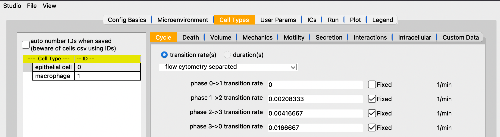
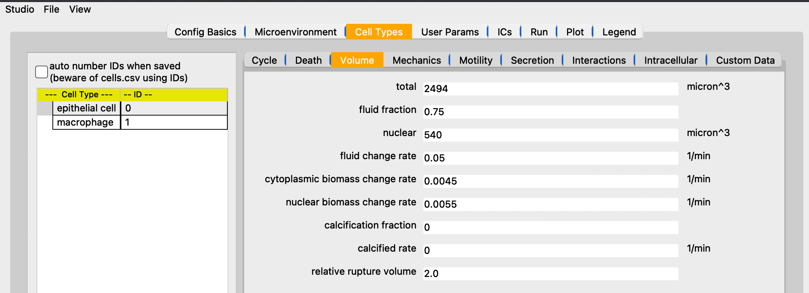
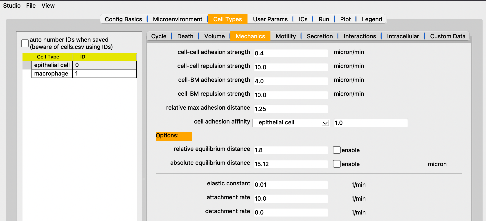
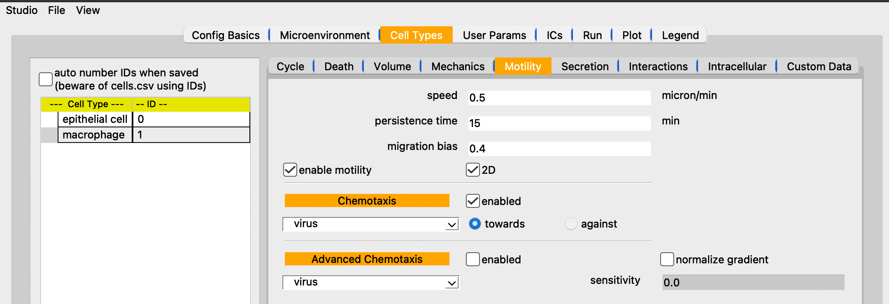
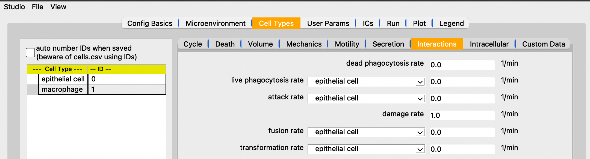
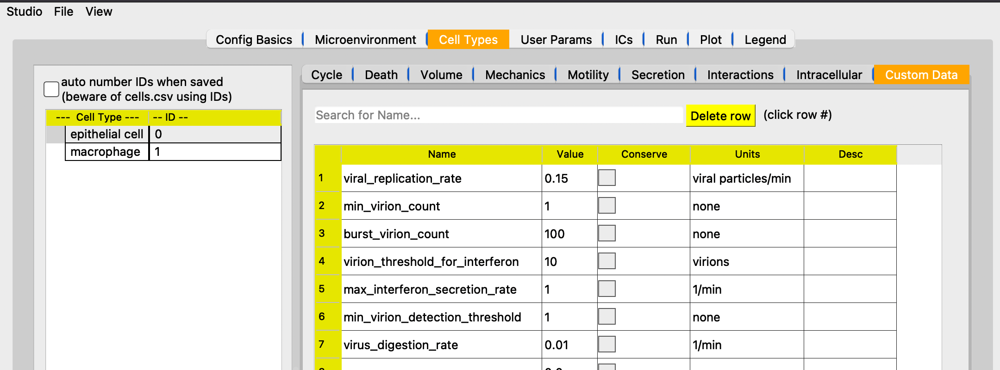

# PhysiCell Studio: User Guide

[[full images](README.md)]
[[medium images](README-medium-images.md)]
[[no images](README-no-images.md)]

PhysiCell Studio is a graphical tool to simplify PhysiCell model editing. It provides a multi-tabbed GUI that allows graphical editing of the model and its associated XML, including the creation/deletion of fundamental objects, e.g., substrates (or signals) in the microenvironment, and cell types. It also lets users run their model and interactively visualize results, allowing for more rapid model refinement.

This document tries to provide brief, but sufficient, guidance on using the Studio - at least its contents (not the challenges involved in developing your particular model). If you experience problems or have questions, please contact us using an appropriate PhysiCell community Slack channel or the Issues section of this GitHub repository. The latter is preferred when reporting a fatal error using the Studio. We also welcome Pull Requests in the Studio's repository (see instructions there) for bug fixes and suggested improvements.

This Guide will be updated as the Studio itself is updated, however there may be a lag. Therefore, if you're running a recent release of the Studio, you may notice some differences in the content described here.

---
## Dependencies

See the README on the Studio GitHub repository for its dependencies.

---
## Running the Studio

There are two primary ways to run the Studio:

1) from a PhysiCell directory: if you have downloaded PhysiCell and are either just learning it, e.g., compiling and running the sample projects, or are actively building your own model, you might run the Studio (installed in another directory) from the command line as follows:
```
python <path-to-Studio-directory>/bin/studio.py -e <name-of-executable-model>
```
Note:
* there are ways to create an alias and/or a symbolic link to shorten this command, depending on your operating system
* you may need to prefix your executable name with `./`, depending on your PATH environment variable
* when you File->Save or Run the model, the configuration file (.xml) will be updated. If you want to retain your original .xml, you should make a copy

2) from the Studio (root) directory:
```
python bin/studio.py
```
Note:
* unless you're running from a "bundled" Studio package which includes a sample executable model, the above command will only let you *edit* a model's .xml and not run an executable. However, you can copy an executable from somewhere else into the Studio root directory and then Run it from there.

A third use case for the Studio is to use it *only* for plotting results (/output) from your model. In that case, you would typically run it from the root PhysiCell directory and in the `Plot` tab, be sure to reference the correct output directory (folder).

---
## Studio Overview


[[Config Basics](#config-basics)] [[Microenvironment](#microenvironment)] [[Cell Types](#cell-types)] [[User Params](#user-params)] [[ICs](#ics-initial-conditions)] [[Run](#run)] [[Plot](#plot)] [[Legend](#legend) ] 

---
## Menu: File -> Samples

We load a PhysiCell sample model to illustrate the contents of the tabs. 

## NOTE: the model (.xml) being loaded from the Studio's `/config` folder has been "flattened". The Studio cannot properly parse a legacy "hierarchical" .xml from PhysiCell where a `cell_definition` may refer to a "parent" in its attributes.


---
## Config Basics


* === Domain ===
* define the model domain size (we recommend leaving dx=dy=dz=20). A 2D model will have Z range: [-dz/2, dz/2, dz]
*  `virtual walls` - if checked, indicates that cells should bounce away from the domain boundaries when they get too close
*  `disable springs` - if checked, do not perform elastic spring attachments between cells
* === Times ===
* `Max Time` - of the simulation
* `/Mechanics/Phenotype dt` - 3 time scales in a PhysiCell model (rf. the PhysiCell method paper). Only modify if you're an advanced user.
* === Misc runtime params ===
* `# threads` - # of OpenMP threads (to help speed up calculations)
* `output folder` - where the output files will be written; relative to where you start the simulation.
* `Save data(intervals)` - there are (primarily) two types of output files saved by PhysiCell: `SVG` (.svg; for cells' positions, sizes, colors) and `Full` (.mat; for substrate concentrations and custom data). Currently, in the Plot tab, when you plot *both* cells and substrates, it assumes those files were written at the same simulation time. Therefore, you should provide the *same* interval value for both if you plan to plot both. However, if you only plan to plot cells' SVG files, then you can set the `Full` interval to a very high value or simply uncheck it to not have any substrate or cells' custom data saved.
* === Initial conditions of cells ===
* `enable` - check if you are providing a text file that contains data for the initial conditions of cells, including their positions, cell types, etc.

[ [top](#physicell-studio-user-guide)] [[Config Basics](#config-basics)] [[Microenvironment](#microenvironment)] [[Cell Types](#cell-types)] [[User Params](#user-params)] [[ICs](#ics-initial-conditions)] [[Run](#run)] [[Plot](#plot)] [[Legend](#legend) ]

---
## Microenvironment


* Define the substrates (or signals) used in the model
* Selecting one in the box on the left will update the parameters on the right.
* The `New` button will create a new substrate with default parameters
* The `Copy` button will create a new substrate with the same parameters as the currently selected substrate
* The `Delete` button will delete the currently selected substrate
* To rename a substrate, double-click it, modify the name, and press the Enter/Return key
* The parameters on the right should be mostly self-explanatory. However, note that the `Dirichlet BC`(Boundary Condition) `Apply to all` button only copies the value provided to each of the boundaries. It does *not* toggle on (enable) those boundaries. You must explicitly enable any boundary that you want to be Dirichlet conditions.
* `calculate gradients` - check if you want substrate gradients to be computed at each "Mechanics dt" timestep. You would need to do so, for example, if certain cell types were chemotaxing (rf. Cell Types | Motility subtab).
* `track in agents` - check if you want cells to keep track of the substrate concentration during secretion

[ [top](#physicell-studio-user-guide)] [[Config Basics](#config-basics)] [[Microenvironment](#microenvironment)] [[Cell Types](#cell-types)] [[User Params](#user-params)] [[ICs](#ics-initial-conditions)] [[Run](#run)] [[Plot](#plot)] [[Legend](#legend) ]

---
## Cell Types


* This tab is used to define the phenotype for each cell type and therefore exposes a large number of parameters. Note that it has subtabs, one for each phenotypic cell behavior.
* ...

---
<details>
  <summary><h3>Expand to show Cell Types subtabs</h3></summary>

[[cycle](#cycle)] [[death](#death)] [[volume](#volume)] [[mechanics](#mechanics)] [[motility](#motility)] [[secretion](#secretion)] [[interactions](#interactions)] [[intracellular](#intracellular)] [[custom-data](#custom-data)] 

  ### Cycle
  

   Define the cycle parameters for this cell type.
  
  ### Death
  

   Define the death parameters for this cell type.

  ### Volume
  

   Define the volume parameters for this cell type.

  ### Mechanics
  

   Define the mechanics parameters for this cell type.

  ### Motility
  

  

   Define the motility parameters for this cell type.

  ### Secretion
  

   Define the secretion/uptake parameters for this cell type.

  ### Interactions
  

   Define the interactions parameters for this cell type.

  ### Intracellular
  

   Define the intracellular parameters for this cell type.

  ### Custom Data
  

   Define the custom data parameters for this cell type.


</details>

[ [top](#physicell-studio-user-guide)] [[Config Basics](#config-basics)] [[Microenvironment](#microenvironment)] [[Cell Types](#cell-types)] [[User Params](#user-params)] [[ICs](#ics-initial-conditions)] [[Run](#run)] [[Plot](#plot)] [[Legend](#legend) ]

---
## User Params


User parameters are general model parameters (as opposed to Cell Types | Custom Data parameters which are specific to cell data). User parameters are accessed in your model's C++ code. Search for `parameters.ints, parameters.doubles`, etc, in various sample projects' `custom.cpp` files. You can click/drag a column separator in this table to change its width. (Unfortunately, that column width information is not retained if you exit the Studio and start it again)

[ [top](#physicell-studio-user-guide)] [[Config Basics](#config-basics)] [[Microenvironment](#microenvironment)] [[Cell Types](#cell-types)] [[User Params](#user-params)] [[ICs](#ics-initial-conditions)] [[Run](#run)] [[Plot](#plot)] [[Legend](#legend) ]

---
# ICs (Initial Conditions)


The ICs tab provides a graphical tool that lets you create fairly simple initial conditions of cells. For now, those ICs are just x,y,z positions and cell type (by name or ID). The currently supported geometric regions in which cells can be placed are boxes (rectangles) and annuli (or disks). The center of either of those regions is specified using x0,y0,z0. R1 and R2 represent the distances/radii. For boxes, R1= (absolute) x-distance from the center to each left/right edge; R2= y-distance from the center to each top/bottom edge; For an annulus: R1= inner radius; R2= outer radius (if R1=0, the shape becomes a disk). Each region can be filled in two different ways: randomly or hex-filled. You only specify the # of cells for the random fill. Note that you can select a cell type from the combobox at the top. The size (radius) of each cell is determined by the Cell Types | Volume (total) parameter.

The typical steps are: select the region type, fill type, # cells (if fill type = random), center of region, R1 and R2. Then click `Plot` to see if they appear where you expect. If not, either click `Undo last` or `Clear all`. Repeat if you have more regions to fill with ICs. When you have the ICs you want, click `Save` to write out the .csv file to the specified folder and filename. The `use cell type names` are the newer (v2 format) way of providing a cells.csv file. If that box is unchecked, the .csv file will be written with cell type IDs instead (v1 format).

[ [top](#physicell-studio-user-guide)] [[Config Basics](#config-basics)] [[Microenvironment](#microenvironment)] [[Cell Types](#cell-types)] [[User Params](#user-params)] [[ICs](#ics-initial-conditions)] [[Run](#run)] [[Plot](#plot)] [[Legend](#legend) ]

---
# Run


[ [top](#physicell-studio-user-guide)] [[Config Basics](#config-basics)] [[Microenvironment](#microenvironment)] [[Cell Types](#cell-types)] [[User Params](#user-params)] [[ICs](#ics-initial-conditions)] [[Run](#run)] [[Plot](#plot)] [[Legend](#legend) ]

---
# Plot


[ [top](#physicell-studio-user-guide)] [[Config Basics](#config-basics)] [[Microenvironment](#microenvironment)] [[Cell Types](#cell-types)] [[User Params](#user-params)] [[ICs](#ics-initial-conditions)] [[Run](#run)] [[Plot](#plot)] [[Legend](#legend) ]

---
For 3D plotting, the following are useful commands to affect the display and mode of interaction:
```
Keypress j / Keypress t: toggle between joystick (position sensitive) and trackball (motion sensitive) styles. In joystick style, motion occurs continuously as long as a mouse button is pressed. In trackball style, motion occurs when the mouse button is pressed and the mouse pointer moves.
Keypress c / Keypress a: toggle between camera and actor modes. In camera mode, mouse events affect the camera position and focal point. In actor mode, mouse events affect the actor that is under the mouse pointer.
Button 1: rotate the camera around its focal point (if camera mode) or rotate the actor around its origin (if actor mode). The rotation is in the direction defined from the center of the renderer's viewport towards the mouse position. In joystick mode, the magnitude of the rotation is determined by the distance the mouse is from the center of the render window.
Button 2: pan the camera (if camera mode) or translate the actor (if actor mode). In joystick mode, the direction of pan or translation is from the center of the viewport towards the mouse position. In trackball mode, the direction of motion is the direction the mouse moves. (Note: with 2-button mice, pan is defined as <shift>-Button 1.)
Button 3: zoom the camera (if camera mode) or scale the actor (if actor mode). Zoom in/increase scale if the mouse position is in the top half of the viewport; zoom out/decrease scale if the mouse position is in the bottom half. In joystick mode, the amount of zoom is controlled by the distance of the mouse pointer from the horizontal centerline of the window.
Keypress 3: toggle the render window into and out of stereo mode. By default, red-blue stereo pairs are created. Some systems support Crystal Eyes LCD stereo glasses; you have to invoke SetStereoTypeToCrystalEyes() on the rendering window.
Keypress e: exit the application.
Keypress f: fly to the picked point
Keypress p: perform a pick operation. The render window interactor has an internal instance of vtkCellPicker that it uses to pick.
Keypress r: reset the camera view along the current view direction. Centers the actors and moves the camera so that all actors are visible.
Keypress s: modify the representation of all actors so that they are surfaces.
Keypress u: invoke the user-defined function. Typically, this keypress will bring up an interactor that you can type commands in.
Keypress w: modify the representation of all actors so that they are wireframe.
```